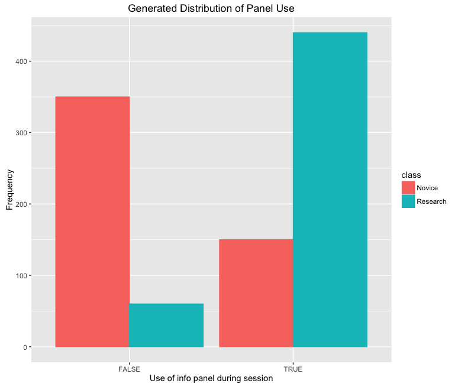
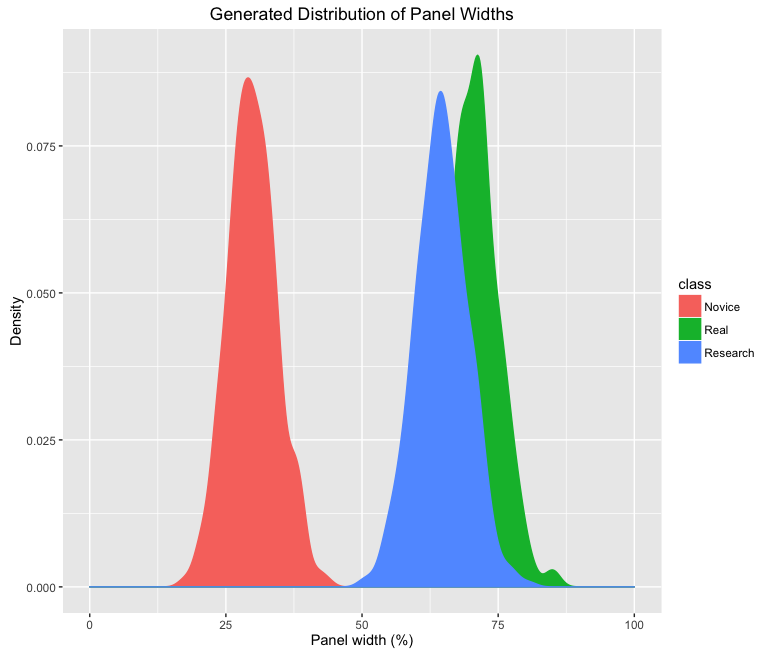

# Abstract
Constructing hypothetical scenarios and user naratives is a common technique for communicating the envisioned user experience (UX) of a tool. Using this approach, application developers rapidly build stories of expected use cases that concretize the intended UX. This design strategy is effective, cheap, flexible, and simple to implement. However, most narrative scenarios are not formal, rather they lack a mathematical basis suitable for statistical testing and rigorous delineation of usership patterns.  In this paper, I describe an effort for underpinning use case scenarios (UCSs) with a probability framework. Under this framework, UCSs are modified to include probability distributions describing the use of each interface component. This approach offers at least three advantages that complement traditional scenario-based design approaches: (1) it enables formal statistical testing of use patterns, with both hypothetical data and, once the tool is put into production, real usage data, (2) it creates the potential for novel visualizations of application use, and (3) it creates the possibility of incorporating Bayesian data assimilation into interface design decisions, offering insight for future designers. Moreover, the method provides a way of informing personalization and customization traditional in large e-commerce systems with much less data, ideal for systems with fewer users. Here, I illustrate the application of the framework using a conceptual example and a hypothetical interface. Several UCSs are explored and fuzzy statistical methods are shown to effectively delineate between them when configurations are drawn at random from the newly implemented probability distributions.

# Introduction
Powerful web programming frameworks and widespread consumer access to low-cost, high-speed, internet-enabled computing devices have resulted in a host of highly interactive, richly-featured applications that use the Web as a platform. These apps rely on a two-way communication model that encourages user-generated content generation and social interaction between users. As cloud services gain popularity, these web apps are an increasingly large portion of the software used on a daily basis. Workflows, such as email and calendar, and increasingly, work activities, such as word processing and data analysis, are done on software 'in the cloud'. That is, these applications are hosted on cloud-based infrastructure, forming a software-as-a-service (SaaS) that enables synchronous information retrieval and preference persistence across devices, creating a seamless user experience. Often, these applications serve multiple user groups, with different interests, motivation, or skills. To maintain a positive user experience for all users, artificial intelligence (AI) and machine learning (ML) algorithms are often applied to recognize user actions, identify likely sequences of interactions, recommend suggested products, and adapt the interface to the individual's preferences. These approaches improve the design of web-based systems by exposing the user to less information and visual clutter, allowing their cognitive function to be more focused on the reason for using the interface in the first place. While AI and ML personalization and customization approaches are well-theorized, widely used, and generally accurate, these techniques have two important drawbacks. First, because they typically model the user based on the sequence of interactions taken by a user during an interaction session (i.e., the clickstream) these algorithms often require large amounts of data from many user sessions. Such large amounts of real usage data may not be available for alpha- or beta- stage applications still under active development. Second, AI approaches do not typically account for expected usage as envisioned by the application developers and domain experts. In many cases, these stakeholder groups go to great lengths to characterize the user and their expected user experience (UX) with the interface.

Specifically, application developers often work with a team of designers and domain experts to develop narrative scenarios about the expected UX of a tool in a process known as scenario based design[SBD, @Rosson:2002vj; @Carroll:1999hh]. Scenarios provide a common vocabulary for communication between stakeholders by describing how a user will interact with a tool [@Anonymous:MZBQUkQZ]. SBD is used in a wide variety of fields, and is not limited to development of software systems [@mcdonaldm:2004us; @Anonymous:P3P38N9F]. Within software development, it is often used to inform the requirements of a proposed tool during their negotiation. Scenarios provide a flexible and cheap method of communicating concrete use cases, and have been shown to improve utility and usefulness of the resulting tool[@Anonymous:MZBQUkQZ].

However, by definition, the scenarios produced during SBD are informal [@Rosson:2002vj; @Rosson:2005vj]. If a scenario is formalized, it changes in both form and purpose, from an illustrative device for communication to a document describing the functional requirements of the tool [@mcdonaldm:2004us]. Requirements documents are often more concerned with the feasibility of the tool than the utility and usability by the envisioned user. In the present study, I develop a method, probabilistic scenario based design (pSBD), for creating formal user scenarios that maintain the connection to the envisioned users and their intended use of the tool under development by enhancing traditional SBD scenarios with probability distributions. In this method, each scenario consists of probability distributions that describe the use of each proposed interface component, function, or logical element in the envisioned interface. In a simple case, these distributions can simply represent the probability that the user described in the scenario will use that component. In more complex cases, these distributions can describe the dimensions of a user-configurable layout or the geographic center of a map component.

This development model has advantages for UI developers and could alleviate some of the challenges associated with implementing AI-based personalization systems.  By introducing a probability model, pSBD facilitates improved inference of user interaction patterns, before the interface has undergone extensive use. Rather than informally constructed narratives, scenarios become suitable for formal statistical testing of user interaction patterns, distinction between real usage and envisioned usage, and prediction of success of future interfaces at a component level. Because the probability model is developed during the planning and development stages along with the UI, AI customization systems have data to work with immediately. And, because a probability distribution already describes the application developers' best estimate of UI usage, less data is required to determine if a future user falls into a particularly user model.

I imagine at least three immediate and important benefits of pSBD, illustrated in the case study below. First, this method would allow for novel visualizations techniques. These visualizations would show in a concise manner how target user groups' UX would differ, thereby improving communication between stakeholders, developers, and designers. Second, pSBD enables the formal statistical testing of interaction with an interface. Specifically, pSBD allows the testing of if real usage patterns conform with the expectations of the development team. This could be particularly useful during design interactions to improve the interface to meet expectations. Finally, pSBD is amenable to Bayesian data assimilation. Observations of actual usage can be incorporated into the probability framework as the application is deployed. The interface can then adapt, in an intelligent way, to reflect both the envisioned usage of the designer and the real world usage patterns of the target audience. While not as sophisticated as many of the AI personalization systems currently on the market pSBD is flexible, inexpensive, and requires relatively little data.  Furthermore, the inferences generated by implemented pSBD in a real world application can be formally shared to improve the design of future interfaces by providing an informed set of priors for use in future scenario development.

The balance of this paper proceeds as follows. First, I outline contemporary techniques in user interface personalization and recommendation. I argue that that SBD provides an intriguing opportunity to integrate additional information into the process of personalization systems. Additionally, I discuss existing methods for including Bayesian inference and prediction in the design and function of user interfaces. Second, I describe the methodology for enhancing simple scenarios from SBD with probability distributions, with special consideration on techniques for negotiation the distribution between developers, designers, and domain experts. Third, I illustrate the derived statistics, visualizations, and prediction possible with the new method. Finally, I conclude with by addressing the limitations of the methodology and its utility in the real world.

# Background and Prior Work
## Intelligent User Interfaces

In the contemporary world, apps help us choose what music to listen to, which roads to drive on, which friends to talk to, and which products to buy. Well designed UIs with efficient UXs instill positive feelingss of success and competency in their users, receding into the background to enable users to focus on their work, exploration, or pleasure [@shneiderman2010designing]. AI and user modeling play important roles in helping the interface to disappear. AI-based interfaces can improve user experience by exposing users to less choice in decision making or by partially or fully executing tasks that are commonly executed by users with similar traits. The first example is often used by large online retailers to limit consumer exposure to large catalogues of items; rather, consumers are only exposed to items thought to be a potential next purchase [@Anonymous:g-HgdBHO]. Such choice-limiting allows user to focus cognitive energy on the important task (buying an item) rather than an enabling task (choosing which item to purchase).

In both cases, user models are constructed and used to determine and characterize the traits of a given user. The construction of user models is a focus of active research in contemporary human-computer interaction study, and is important in recommendation systems, social computing, intelligent search algorithms, and adaptive interfaces[@Cunha:2014vu]. MORE ABOUT USER MODELING p.1: p.1: User modeling involves inferring unobservable information about a user from observable information about him/her, e.g. his/her actions or utterances. -- Highlighted May 2, 2017

Adaptive user interfaces (AUIs) leverage a user's stream of interactions to place a user in a user model. Based on that model, commonly taken actions are then made more visible to the user or undertaken by the interface automatically.

 identify a user based on their actions and then automatically execute routines commonly executed by users conforming to that model. AUIs are systems that adapt to the needs of different users for a variety of tasks [@Anonymous:VabnjUVa]. AUIs are often implemented in the context of intelligent tutoring and educational systems, in the user model controls and keeps track of how a user is progressing towards an educational goal [@Anonymous:rA5_Wtin]. In general, AUIs work by identifying membership in a user group based on a series of events. In effect, this means analyzing the click stream from a user's interaction session with the interface. This can be a challenging amount of data to manage and analyze. p.3: To detect user behavior patterns, the interface must be able to track all basic interface events. -- Highlighted May 2, 2017 p.4: Adaptive interfaces also need data from users after they act. The more proactive an adaptive interface, the larger the amount and quality of feedback it needs from users in order to determine whether or not it has acted appropriately and whether it should modify its behavior. -- Highlighted May 2, 2017

Predictive statistical models are often used to determine what a user will do, based on the sequence of actions they've taken during an interaction session, or, in the case of cloud-based applications, over the course of all interactions made with the interface. Most of these are focused on identifying the plan the user will most likely take, given that they have taken a certain sequence so far. These models are typically divided into two categories, content-based or collaborative [CITE] [MORE ABOUT THIS]. p.11: These enhanced models can then make more accurate predictions about the behaviour of individual users by matching these users to a particular group.  -- Highlighted May 2, 2017

While AI is often used to improve sales in an online context, it has also been used in the past to improve the design of an application. Particularly in the context of AUIs, computing power can be used to determine how and when to proactively assist the user [@Anonymous:VabnjUVa].  Multi-level interfaces are an important target for AI assistance.  For example, a novice user would receive a more detailed and longer sequence of dialog steps with additional extent of assistance [CITE]. This often requires checking whether the user has the required knowledge to complete the steps on their own. Some systems are able to adaptively configure themselves to display only the components most suited to the current user of the tools and their immediate goal. p.380: It determines an adequate combination of diverse user interface components, adapted to the identified context of use. -- Highlighted May 2, 2017
p.380: Each addressed user interface component renders an individually assigned part of the output as final user interface (see Fig. 2). -- Highlighted May 2, 2017

These techniques all typically require that the algorithm be provided with a tremendous amount of data. Specifically, these algorithms often need to know the entire click stream of a user's session to place them into a user model and make plan for what the user is likely to do next. Moreover, to train these algorithms, data on many users is required. Finally, while these technique reflect the actual use of the tool, the intended use of the tool, as characterized by the tool developers and domain experts, is not taken into account.

## Scenario Based Design

SBD scenarios are flexible, low-cost, and evocative representations of a designer's envisioned use for a tool. While the details may differ between implementations of SBD, all are aimed at concretely describing the use of a tool early in its development [@Rosson:2002vj].  These narratives generally contain four elements: a setting, an actor with personal motivation, knowledge, capabilities, assumptions and background about the actors and their objectives, and sequences of actions and events in which the actors manipulate the tools and objects surrounding them [@Rosson:2005vj; @mcdonaldm:2004us; @Carroll:1999hh]. Typically, actors execute a sequence of actions and events that lead to some outcome [@Rosson:2002vj]. Scenarios can be expressed in a variety of ways, such as through text, videos, mockups, or storyboards. Furthermore, textual representations may be expressed in either formal or informal language [@mcdonaldm:2004us].

Scenarios have been used in a wide variety of development fields. MORE ON THIS. Within HCI, SBD has been used in the building and development of tutorial systems, programming environments, web sites, and more [@Anonymous:MZBQUkQZ].

It is important to note that scenarios, by design, are informal and do not attempt to outline functions or requirements. Scenarios have been described as a sketch of the envisioned UX of the tool, capturing future use cases as a pencil sketch would capture a physical object [@Rosson:2005vj], evoking reflection in the context of design [@Carroll:1999hh]. While not a formal or extensive list of functions or features, they can be used as a communication tool. Scenarios can inform brainstorming between development team members, inform UI design, and act as a guide when developing formal requirements [@Rosson:2005vj; @Anonymous:MZBQUkQZ]. Scenarios are more flexible than functional decomposition of a tool, while maintaining the croncrete vision of intended use that avoids indeterminate design steps [@Carroll:1999hh]. By viewing the proposed tool from the perspective of the envisioned user, scenarios are able to effectively communicate tradeoffs between design decisions [@Carroll:1999hh]. Unlike approaches that explicitly model human behavior and decision making, SBD is lightweight and effective in creating a shared vision of an  tool. Moreover, the products created during SBD can be used as design rationale during tool development, maintenance, and evolution.

While scenarios provide a clear communication mechanism and concrete products on which to guide future development and design activities, they lack a mathematical or statistical basis. A rigorous basis for scenarios would be particularly useful during development of a tool with multiple intended user groups, i.e., one with multiple scenarios informing its development. A statistical model could more accurately represent, both formally and visually, differences between the groups of users in their expected use of a tool or component. Additionally, SBD lacks a mechanism of formally adapting to include lessons learned from previous design iterations. While knowledge can be shared informally, one scenario cannot truly inform future scenarios.

## Bayesian Inference
One common method of representing knowledge is with through the use of Bayesian statistics. The fundamental purpose of statistical inference is to draw, from a numerical dataset, concrete conclusions about qualities of a system that cannot be observed. In Bayesian statistics, these conclusions are represented in terms of probability statements, conditional on the analysts belief of the true nature of the system and the observed dataset [@Andrew:2013un]. By representing parameters and conclusions as probabilities, Bayesian statistical inference provides a formal mechanism for account for uncertainty. In the standard classical statistics, it is difficult to take into account prior knowledge when testing hypotheses and statistical experiments demand large sample sizes. Moreover, it is difficult to use the results from one experiment to predict the outcome of a future experiment [@Ellison:1996js]. The Bayesian paradigm provides a coherent approach for combining information from new and existing information in a probabilistic framework [@Wikle:2007dy]. Bayesian inference allows the a probability model to be fit to a new dataset, and the results summarized by probability distributions on both the parameters of the model and unobserved, or unobservable, latent qualities of a system [@Andrew:2013un]. Bayesian inference is often used in the context of probabilistic forecasting, where an existing numerical or physical model is used in conjunction with a set of observations to update knowledge about the true state of a system [@Wikle:2007dy]. This process is known as data assimilation. Observed data for unobservable phenomenon.

Bayesian inference is not new in user modeling studies. Bayesian belief networks are common technique for representing user models in AI-based personalization systems. Bayesian belief networks are directed acyclic graphs that represent a conditional probability of an event's occurrence at each node. Bayesian belief networks are a powerful structure for representing knowledge and reasoning about future events under conditions of uncertainty [@Cheng:1997wg]. By representing nodes as conditional probabilities, each node represents the probability of an action, given all other information. Belief networks are employed by traversing the graph to determine that probability. Bayesian user models can take into accoutn a user's background, actions, and queries when reasoning about what the user's most likely next step will be [@Fischer:2001jl; @Anonymous:6QvxqPLs]. User modeling often deals with significant amounts of uncertainty, to make inferences about a user in the absence of complete information, making Bayesian approaches particularly suitable [@Anonymous:98QvTtXB].

Bayesian networks have been used in a variety of contexts related to user modeling. The Lumiere project, supported by Microsoft, used Bayesian belief networks to develop Microsoft Office Assistant, which first shipped in Microsoft Office '97 [@Anonymous:6QvxqPLs]. Belief networks have also been of particular interest in educational tools and interactive tutoring applications, which require that a system recognize what a student is trying to accomplish en route to an educational goal [@Anonymous:6QvxqPLs; @Anonymous:rA5_Wtin]. A belief network was also used when developing a tool to take a user's heart rate via a cellphone camera [@Fan:2015du].

It can be difficult to specify the entire state-space graph manually in order to build a Bayesian belief network suitable for user modeling. Often alternate techniques are used to build the state-space which are then converted to belief networks [@Anonymous:rA5_Wtin]. Indeed, this is how many early AI systems were designed, resulting in what is referred to as the bottleneck problem, where humans are the limiting factor in deriving additional knowledge [@Anonymous:98QvTtXB]. Instead, most networks in the user modeling problem are designed using other tools that can specify the state spce [@Anonymous:rA5_Wtin], or by creating them from the underlying user interaction data [@Anonymous:XBUc-RmI; @Adomavicius:2015fx].

In this paper, I do not attempt to characterize the full design space as a Bayesian belief network; although that would be a worthy priority for future research. Rather, within each scenario, each interface component or function is given its own, independent probability distribution, and principles of Bayesian data assimilation are used to update current information about tool usage. Bayesian data assimilation involves fusing observations and prior knowledge together is a statistical framework to obtain an estimate of the distribution of the true state of the underlying process [@Wikle:2007dy]. This is accomplished by using Bayes theorem to obtain a posterior distribution through the use of a likelihood function and prior function. Data assimilation is often used din spatiotemporal context for numerical weather and climate models [@Anonymous:iWRnIEw7; @Wikle:2007dy; @Airoldi:2007br], as well as in ecological and phylogenetic modeling [@Dawson:2016wa; @Ellison:2004fj; @Ho:2009gn], among other fields.

A key consideration of many AI algorithms that characterize users in terms of their browsing patterns is that they must assume that the user's browsing pattern maintain their preferences over time, what Lieberman (1995) calls persistence of interest, where user maintain their behavior or interests over time. The Bayesian assimilation technique introduced here allows user groups to evolve through time. Initially, user group characteristics are heavily influenced by stakeholder input. However, as more people use the system, their input is updated in the model of how the group uses the system. If this usage pattern changes through time, the assimilation routine would capture this shift in a statistically meaningful way.

# Method
Underpinning a user-case scenario with probabilities is an iterative process that may involve designers, developers, and stakeholders. While it is not essential, it may be helpful to have a low-fidelity wireframe [@Roth:2015ts] of the intended interface. Wireframes, rough visual outlines of the intended tool, can be used to identify and name the components during negotiations over the probability distributions. If statistical testing and data assimilation is required, an alpha- or beta- release prototype of the application is required, so that real user feedback can be included in the statistical inference.

The first step in pSBD is to develop clearly defined narrative scenarios of the use of the tool. For reference on building traditional SBD scenarios, see @Rosson:2002vj; @Carroll:1998tl. These use cases should be crisply defined and include the four essential elements of SBD scenarios: actions, background information, goals and objectives, and actions or event sequences that lead to an outcome [@mcdonaldm:2004us]. The scenarios should be clearly articulated, as in traditional SBD. The scenarios may be captured in either visual or written form.

The second, and most fundamental task in pSBD, is to enhance these written or visual narratives with probabilities that capture the intuition of the application developer. These statistical statements will later be modified through negotiation with other stakeholders. In this step, for each scenario, each component of the intended interface may be enhanced with a probability statement. These statements may describe the probability of use by the actors in the scenario. Additionally, they may specify design elements such as the width of user-configurable components, the zoom level or geographic center of interactive map components, or the probability of the filter criteria on a particular filter facet, depending on the scenario and the interface. In general, the goal of this step is the quantify the use or style of each component of the scenario as a random variable. By characterizing each component as a random variable, you are allowing for 'agency' by the actors in the scenario, while describing gross trends common amongst all members of the group.

An essential piece of this framework is specifying the correct distribution for the scenario. The probability of use of various components can be modeled as a Bernoulli distribution with a probability of use (success) for the given actor, $\alpha$ and a probability of not using the component $1-\alpha$.  Event, such as the number of times users invoke a specific feature, may be characterized using other discrete distributions, such as the Poisson distribution, with a designer specified rate parameter $\alpha$, or by a binomial distribution with a probability of that event occurring, $\alpha$. Initial observations appear that few components described in scenarios are truly real-valued, suitable for infinite continuous distributions. Because of interface constraint, users are typically not exposed to truly infinite freedom in any aspect of interaction [@Roth:2013fv]. Continuous variables can be modeled using a gamma distribution, which goes to infinity, but is truncated at zero, or discretized and modeled as a binomial distribution.

Because the distributions are, ultimately, a way of communicating between developers and stakeholders, once they have been initially specified, they should be refined by negotiation with stakeholders, domain experts, and other members of the development team. During this processes, alternate distributions may be proposed, or, more likely, the distribution parameters may be tweaked to more accurately reflect the stakeholder's input. Each member of the development and design team, particularly if it includes domain experts, are likely to have important input into how they envision the application will be used. To facilitate communication, some of the novel visualization types introduced below may be produced to dynamically reflect the ongoing negotiations.

Communication and negotiation with the target users can be done in several ways. Informal interviews with key members of each stakeholder may be the best approach. Other social science data collection methods, including formal interviews or focus groups may also be effective. While an online survey would capture the opinion of more potential users, distribution negotiation should, in most cases, be limited to the users most qualified to comment on the potential use cases of the user group. Real world uses may be compared and used to refine the distributions during the data assimilation phase once the application has been released into alpha-, beta-, or production.

Once the distributions have been finalized, a user model is then available for subsequent analysis. One of the initial activities that can be done with the user models is to generate probability-generated configurations (PGCs). These configurations are drawn from the independent distributions of each component to create a combination of interface components representative of a hypothetical user conforming to that user model. These combinations can then be used to produce visualizations regarding component use or design among groups or to highlight intra-group variability. Visualizations can include principle components analysis (PCA), which break down the multifaceted differences in the PGCs among scenarios into a compelling visualizations describing the components explaining the most variation between groups. Alternatively, plots that describe the density of density of a parameter or frequency of use of a component can be effective in communication. A final potentially useful visualization type is a wireframe with probability densities overlain, which may be useful in describing varying usage patterns to designers and developers. These visualization are developed further in the case study below.

In this initial investigation, PGCs are generated from random draws from multiple independent probability statements. Future work could focus on deriving PGCs from a joint distribution that conditions each component's status on all others. For example, consider conditioning the width of the panel on whether or not it is open in this particular PGC (P(width | open)), rather than drawing from both the width distribution (P(width)) and the isOpen distribution (P(open)).

If the application in question does have an alpha-, beta-, or production ready version that can record interactions, statistical questions including *"are real usage patterns the same as expected usage patterns?"* and *"given a real user's configuration, what user model do they likely fall within?"*. These questions can be important early in the development processes, and can help designers improve default settings or refine interaction strategies for different groups. Fuzzy-logic clustering, which leverages fuzzy logic to delineate clusters that may overlap, can be helpful in determining statistical differences between real and expected usage patterns. Similarly, this type of clustering can be helpful in partitioning space to determine the model most likely from a real user's newly generated configuration.

Finally, the real usage patterns can be assimilated into the existing scenario-based distributions. If the application allows interaction logging that keeps track of user's interactions or representations, this data can be used as the observations in the Bayesian data assimilation phase. These are then transformed into a likelihood function, which specifies the probability of the data given the model ($P(data | parameters)$). The existing scenario-based distribution is used as the prior distribution, describing the probability of the model ($P(parameters)$). By applying Bayes' rule, $p(parameters | data) \propto p(parameters)p(data | parameters)$, which yields the probability of the parameters given the data. Upon this application of Bayes' rule, we are left with a posterior distribution, which includes the updated information gained from including the real-usage data in our belief about the true value about user behavior. The process can be repeated an arbitrary number of times; in each successive iteration the posterior becomes the prior, representing our current best guest at the unobservable human behavior. Each time, new data is incorporated to more accurately represent our knowledge about the human behavior process.

# Case Study
## Introduction
In this section, I introduce a simple yet illustrative case study demonstrating the utility of the method described here. Consider an interface with two components, the *map panel* and *information panel*. The information panel can be opened and closed via a user interaction as well as be resized on demand by the user. The user cannot control the dimensions or presence of the information panel, but, as screen size is fixed,it takes pixels that would otherwise belong to the main panel, if it is in the open position. The interface is illustrated for both the information panel open state and the information panel closed state in Fig. 1. Imagine that the map panel contains an interactive map that can be browsed by the user, with points describing the spatiotemporal position of a geographic phenomenon overlaid on the map. In this example, the geographic phenomenon is murder events in the city of Chicago. The information panel has additional information about each occurrence of the phenomenon, and additional information about each point can be accessed and displayed in the panel when the user clicks on the corresponding point on the map. The attributes associated with each event include fields like weapon, time of day, day of week, and whether a subject was arrested in connection with the crime.

The developers of this interface envision two potential user groups, novices and researchers. A key difference between novices and researchers is that they are unlikely to dig as deeply into the details of each murder as their researcher peers. With that in mind, the application developers envisioned two simple scenarios to describe the use of each of these user groups (Box 1).

|Table 1: Narrative scenarios|
|:----------------------------------------------:|

| Scenario: Novice |
|:----------------------------:|
|*User one is a student at the University of Chicago, enrolled in an introductory geospatial analysis class. She has a personal motivation to understand the patterns in murders, because she lives in Chicago. She has also been tasked with identifying the salient features of the spatiotemporal distribution of the murders for her classes. She is unlikely to investigate the details of each crime; rather, she is likely to browse the map itself to determine if she can recognize patterns in the spatial distribution.*|

| Scenario: Researcher |
|:----------------------------:|
|*User two is a criminology professor at the University of California, Berkeley. She is interested in a recent spike in murders, but has no firsthand experience with Chicago. She is particularly interested generating hypotheses about murder weapons in different parts of the city. She is likely to make extensive use of the information panel. Furthermore, because her interest is primarily in the attributes associated with each crime, she is less interested in the map component. She will likely open the information panel to dominate the visual layout of the application to focus her attention there.*|

## Assigning Probabilities
From these basic narrative scenarios, we can infer potentially differing patterns of use (Table 2). Indeed, we can determine, from these scenarios, how the prototypical research user's interface might be displayed and how it might differ from that of the prototypical novice user. At this point, we may begin to assign probabilities to the scenarios. In this case study, we will consider only two statistical statements for each scenario. Specifically, we will specify the probability of use of the information panel and the probable width of the information panel. Since the novice user is, from the scenario, unlikely to investigate the details of each crime, we can assign her a rather low probability of using the information panel. Using a Bernoulli distribution, we might assign the novice user's $p(infoPanel)=0.25, X \sim (1, 0.25)$. This probability means that, as designers, our best guest suggests that novices will use the info panel approximately one in four sessions with the interface. Moreover, since novices are unlikely to be interested in a particular element of the information panel, we may assume that the width of this panel may be less than half of the screen, perhaps 30% of the screen, when it is open. Specifically, this can be modeled as a binomial distribution with 100 trials, with each trial corresponding to a percentage width on the page ($X \sim B(100, 0.3)$).

We can complete a similar exercise for the researcher model. In this case, the researcher is likely to rely extensive on the information panel. Indeed, from the scenario, it appears that such research may rely entirely on the information from the information panel.  Thus, we assign the probability of use of the information panel as ($p(infoPanel) = 0.9, X \sim B(1, 0.9)$). Therefore, for researchers, we expect nine in ten user sessions to employ the information panel. Furthermore, our scenario specifies that the researcher is likely to dominate the visual layout with the information panel component. Therefore, the assigned probability statement for panel width is $X \sim B(100, 0.65)$, corresponding to an expectation of 65% width.

|Table 2: Probability Statements| | |
|:------------------------------:|:-----:|:-----:|
|Parameter| Distribution | Expectation |
|*Novice*| | |
|info panel| $X \sim B(1, 0.25)$| 0.25 |
| width | $X \sim B(100, 0.3)$ | 0.3 |
|*Researcher*| | |
|info panel| $X \sim B(1, 0.9)$| 0.9 |
| width | $X \sim B(100, 0.65)$ | 0.65 |

## Generating PGCs and Visualizing Them
Using a scripting language, it is possible to generate random draws from these distributions, such as using the distribution functions in R [@RSoftware]. In this way, it is possible to have thousands of PGCs that represent the developer's intuition of how users will interact with the components of the software. From these draws, it is possible to create some visualizations that can be helpful in communicating this intended use. Density plots (Figure \ref{densities}) can be helpful in communicating the variation between and within a user model. Similarly, for the Bernoulli distribution describing boolean values, bar graphs showing relative frequency of each group for each outcome can be compelling. Both of these visualizations can be helpful in inter-design team communication and communicating with stakeholders, because they give a graphical representation of intended use, rather than weak qualifiers like 'more' or 'less'. These representations can be particularly helpful when negotiating between team members to arrive at an agreement for intended use.

Another important visualization metric is the principle components analysis (PCA) plot with loadings. A PCA is a dimensionality reduction procedure the derives new orthogonal dimensions that describe the variance in the dataset. In this case study, there are only two dimensions, so a PCA is not appropriate. However, consider a situation where there are not two dimensions of each PGC but 20 or 50 or 100. In this larger case, it would be difficult to assess the usage of each component separately using densities or bar charts. Here, a PCA would be appropriate. The routine would derive new dimensions. A plot of these new dimensions would thus be easier to digest. The correlations between the derived dimensions and the original dimensions, known as the PCA loadings, are informative in this setting, by describing the agreement between the derived axes and the original axes. In this case, we can examine the loadings the determine how each of the original variables contributes to the new axes, and therefore, which of the original variables are the most important in explaining the most variance in the original dataset.

## Assessing real usage vs. expected usage
While the visualizations outlined above can be helpful in negotiating expected use, the PSBD framework becomes especially valuable when real usage data is available from an in-development or in-production application. In this case study, we will examine a scenario in which we have 'real' usage data for our hypothetical application, that has been synthetically generated for this purpose (Figure \ref{densities_real}).

