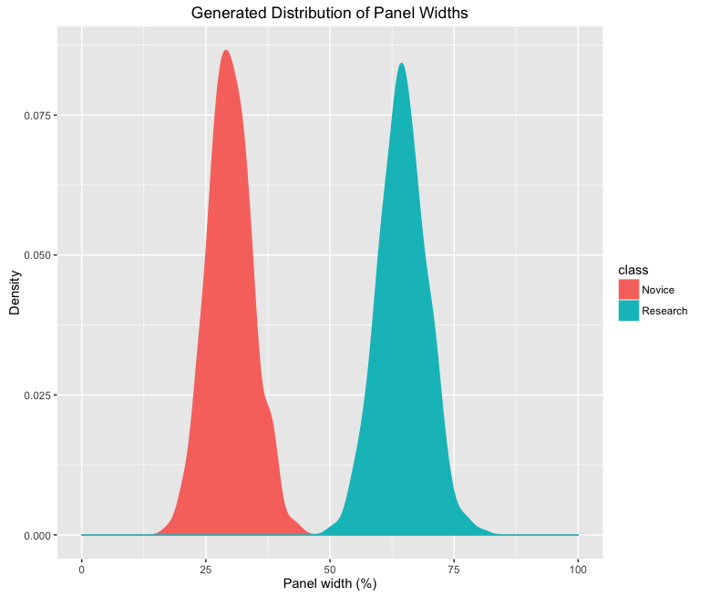

# Introduction
Powerful, easy-to-use programming frameworks and widespread consumer access to low-cost, high-speed, internet-enabled computing devices have resulted in a host of highly interactive, richly-featured applications on the Web. These apps rely on a two-way communication model that encourages the production of user-generated content and social interaction among users. As cloud services gain popularity, these web-based app distribution is becoming increasingly common. Many common tasks, including email, word processing, and data analysis are increasingly done 'in the cloud', facilitated through software-as-a-service (SaaS) that enables synchronous information retrieval and preference persistence across devices to create a seamless user experience [@Hassan:2011uh; @Mosco:2014cu; @Buyya:2009ix]. Often, these applications serve multiple user groups, with different interests, motivation, or skills [@Roth:2013fv]. While it is possible to simultaneously support multiple user groups through carefully engineered design decision, artificial intelligence (AI) and machine learning (ML) algorithms are often applied to recognize user actions, identify likely sequences of interactions, recommend suggested products, and adapt the user interface (UI) to likely preferences to maintain a positive user experience for all users [@Adomavicius:2015fx; @Lalle:2015hfa; @Anonymous:VabnjUVa; @Benson:2010jn].Typically, these approaches improve the tool's UX by exposing the user to less information and visual stimuli, allowing cognitive function to become more focused on specific tasks. While AI and ML personalization and customization approaches are widely-used and efficient, particularly for large applications with many users, these techniques have two important drawbacks. First, because they typically model the user based on the sequence of interactions taken by a user during an interaction session (i.e., the clickstream) these algorithms often require large amounts of data from many user sessions [@linden2003amazon]. Such large amounts of real usage data may not be available for early stage applications still under active development. Second, AI approaches do not typically account for expected usage as envisioned by the application developers and domain experts; rather, user models are generally constructed from the application's usage data [@Mulvenna:2000iv]. However, in many cases, application designers, developers, domain experts, and other stakeholder groups go to great lengths to characterize the user and their expected user experience (UX) with the interface during a user centered design (UCD) process.

Specifically, application developers often work with a team of designers and domain experts to develop narrative scenarios about the expected UX of a tool in a process known as scenario based design (SBD) [@rosson2009scenario; @Carroll:1999hh]. Scenarios provide a common vocabulary for communication between stakeholders by describing how a user will interact with a tool [@Anonymous:MZBQUkQZ]. SBD is used in a wide variety of fields and is not limited to development of software systems [@mcdonaldm:2004us; @Anonymous:P3P38N9F]. Within software development, it is often used to inform the requirements of a proposed tool during their negotiation and to envision the intended use of the software by multiple user groups. Scenarios provide a flexible and cheap method of communicating concrete use cases and have been shown to improve utility and usefulness of the resulting tool [@Anonymous:MZBQUkQZ]. By design, the scenarios produced during SBD are informal [@rosson2009scenario]. If a scenario is formalized, it typically changes in both form and purpose from an illustrative device for communication to a rigorous document describing the functional requirements of the proposed tool [@mcdonaldm:2004us]. Requirements documents are often more concerned with the feasibility of the tool than the utility and usability by the envisioned user. However, a framework for formalizing scenarios while maintaining the flexibility and central focus on the user would improve communication among tool builders by ground discussion with statistical and visual evidence of differences in UX among scenarios. Moreover, formal scenarios could be used to inform personalization algorithms, resulting in more efficient customization.

In the present study, I develop a method, probabilistic scenario based design (pSBD), for creating formal user scenarios that maintain the connection to the envisioned users by enhancing traditional SBD scenarios with probability distributions. In this method, each scenario consists of probability distributions that describe the interactivity and design of each proposed interface component, function, or logical element in the envisioned interface. In a simple case, these distributions can simply represent the probability that the actor in the scenario will use a specific component. In more complex cases, distributions can be specified to describe the dimensions of a user-configurable layout or the geographic center of a map component, for example.

By introducing a probability model, pSBD facilitates improved inference of user interaction patterns, even before the interface has undergone extensive use. Rather than informally constructed narratives that rely on relaxed language, pSBD scenarios become suitable for formal statistical testing of user interaction patterns, distinction between real usage and envisioned usage, and prediction of success of future interfaces at a component level. Because the probability model is developed during the planning and development stages along with the UI, AI customization systems have data to work with immediately that formally account for the developers' intuition for how user groups will interact with a tool.

In the present paper, I describe and illustrated three potential advantages of a pSBD design approach. First, this method would allow for novel visualizations techniques capable of showing, in a concise manner, how UX would differ among target user groups.  Second, pSBD enables the formal statistical testing of interaction with an interface. Specifically, pSBD allows the testing of if real usage patterns conform with the expectations of the development team. This could be particularly useful during design interactions to improve the interface to meet expectations. Finally, pSBD is amenable to Bayesian data assimilation, where observations of actual usage can be integrated as the application is deployed. The interface can then adapt, in an intelligent way, to reflect both the envisioned usage of the designer and the real world usage patterns of the target audience. While not as sophisticated as many of the AI personalization systems currently on the market pSBD is flexible, inexpensive, and requires relatively little data.

The balance of this paper proceeds as follows. First, I outline contemporary techniques in user interface personalization and recommendation, review pertinent literature on SBD, and discuss existing methods Bayesian inference and prediction in the design and function of user interfaces. Second, I describe the method for enhancing narrative scenarios from SBD with probability distributions. Third, I illustrate the derived statistics, visualizations, and prediction possible with the new method using a synthetic case study.

# Background and Prior Work
## Intelligent User Interfaces

Modern web apps help us choose what music to listen to, which roads to drive on, which friends to talk to, and what products to buy. Well crafted UIs and efficient UXs instill positive feelingss of success and competency, receding into the background as users focus on their work, exploration, or pleasure [@shneiderman2010designing]. In many sophisticated apps, AI and user modeling can play important roles in helping the interface to disappear by intelligently limiting the content to which the user is exposed. By processing large amounts of historical usage data and building statistical models of user preference, AI systems can limit consumer exposure to only items that the user is likely to be interested in or partially execute tasks the user is likely to wish to accomplish. These systems are highly profitable, particularly in ecommerce -- by limiting a customer's exposure to a large catalogue of goods, the system encourages consumer focus on a profitable task (buying an item) rather than an enabling task (choosing which item to purchase).

At the heart of many AI personalization algorithms are user models that describe and quantify the traits of the application users. The construction of user models is a focus of active research in contemporary human-computer interaction study, and is important in recommendation systems, social computing, intelligent search algorithms, and adaptive interfaces[@Cunha:2014vu]. Specifically, user modeling involves inferring unobservable information about the user, such as his or her thought processes, intentions, etc, from observable information, such as his/her actions [@Anonymous:98QvTtXB; @Young:2010ck]. While user modeling need not be quantitative, statistical user models allow an application to anticipate behavior, including goals, actions, and preferences [@Anonymous:98QvTtXB]. Models can be constructed as top-down, in which a theoretical understanding of user preferences are prescribed by the model developer, or bottom-up in which associations between sequences of user actions are learned organically. However, most contemporary user modeling approaches can be seen as hybrids that combine aspects of these two categories [@Anonymous:2013be].

In addition to generating personalized recommendations, user models can be used to underpin adaptive user interfaces (AUIs) which adapt in look, feel, and interactivity to that most likely to be preferable to a new user, based on their series of actions. AUIs can provide just-in-time assistance by predicting the user's most likely actions and then performing one or more of those actions on the user's behalf [@Anonymous:tFYXZ8fI]. AUIs can adapt to the needs of different users for a variety of tasks [@Anonymous:VabnjUVa]. AUIs have commonly been implemented in the context of intelligent tutoring and online educations systems. In these cases, the system must adapt to a user's learning syle and pace, and a user model is used in tracking how the user is progressing towards and educational goal [@Anonymous:rA5_Wtin; @Anonymous:6QvxqPLs]. Typically, AUIs work by identifying membership in a user group based on a series of interaction events, which requires tracking all user interaction sequences [@Anonymous:tFYXZ8fI]. Moreover, the more adaptive an interface, the larger the amount and quality of feedback it needs from users to determine if it is adapting in a favorable way [@Anonymous:VabnjUVa].

Multi-level interfaces are an important target for AI assistance.  Multi-level interfaces are specifically designed to support multiple tasks of increasing difficulty for users of different skill levels, motivations, or expertise. For example, a novice user could receive a more detailed and longer sequence of dialog steps than an expert familiar with the system  [@Honold:2014gq]. Such systems would identify the appropriate user model, then assemble the user interface components most suitable for the identified context of use [@Honold:2014gq].

## Scenario Based Design

SBD scenarios are flexible, low-cost, and evocative narratives of a designer's envisioned use for a tool. SBD has been applied to a variety of context; however, while the details may differ between implementations of SBD, all are aimed at concretely describing the use of a tool early in its development [@Rosson:2002vj].  These narratives generally contain four elements: (1) a setting, (2) an actor with personal motivation and skills, (3) assumptions and context about the actors and their objectives, and (4) sequences of actions and events in which the actors manipulate the tools and objects surrounding them [@Rosson:2005vj; @mcdonaldm:2004us; @Carroll:1999hh]. Typically, actors execute a sequence of actions and events that lead to some outcome [@Rosson:2002vj]. Scenarios can be expressed in a variety of ways, such as through text, videos, mockups, or storyboards.

It is important to note that scenarios, by design, are informal and do not attempt to outline the functional requirements of the interface under development. Scenarios serve as a sketch of the envisioned UX of the tool, capturing the essence of future uses of the tool [@Rosson:2005vj], evoking reflection in the context of design [@Carroll:1999hh]. Rather than enumerating requirements, they can be used as a communication tool to ground conversations about the design and interactivity of the application. Scenarios can facilitate brainstorming between development team members, inform UI design choices, and act as a guide when developing formal requirements [@Rosson:2005vj; @Anonymous:MZBQUkQZ]. Like other user-centered design approaches, scenarios maintain a central focus on the target user of the tool, and are thereby able to effectively communicate tradeoffs between design decisions for those specific user groups [@Carroll:1999hh]. Moreover, the products created during SBD can be used as design rationale in later phases of the design cycle.

While scenarios provide a clear communication mechanism and concrete products on which to guide future development and design activities, they typically lack a mathematical or statistical basis. A previous attempt to quantify a scenario with a preference matrix was described in [@Cunha:2014vu], but focuses primarily on the affinities of the user, rather than the attributes of the proposed interface.

## Bayesian Inference
Bayesian approaches to knowledge representation are common in many fields, including in user modeling and adaptive user interface design. Bayesian statistical inference involves drawing concrete conclusions about unobservable qualities of a system, in the presence of uncertainty. These claims are represented in terms of probability statements, conditional on the analyst's belief of the true nature of the system and the observed dataset [@Andrew:2013un]. In classical statistics, it is difficult to take into account prior knowledge when testing hypotheses and statistical experiments demand large sample sizes. Moreover, it is difficult to use the results from one experiment to predict the outcome of a future experiment [@Ellison:1996js]. The Bayesian paradigm provides a coherent approach for combining information from new and existing information in a probabilistic framework [@Wikle:2007dy]. Bayesian inference allows the a probability model to be fit to a new dataset, and the results summarized by probability distributions on both the parameters of the model and unobserved, or unobservable, latent qualities of a system [@Andrew:2013un]. Bayesian inference is often used in the context of probabilistic forecasting or data assimilation, where an existing numerical or physical model is used in conjunction with a set of observations to update knowledge about the true state of a system [@Wikle:2007dy].

Bayesian belief networks (BBNs) are common technique for representing user models in AI-based personalization systems. Bayesian belief networks are directed acyclic graphs (DAGs) in which each node represents a conditional probability of a particular event's occurrence. The probability that an event will occur can be estimate by traversing the graph and calculating the conditional probability at a node, given that all prior events have occurred. BBNs are a powerful structure for representing knowledge and reasoning about future events under conditions of uncertainty [@Cheng:1997wg].  BNN-based user models can take into account a user's background, actions, and previous search queries when reasoning about what the user's intention is most likely to be [@Fischer:2001jl; @Anonymous:6QvxqPLs]. BBNs have been used in a variety of contexts related to user modeling, including in Microsoft Office Assistant [@Anonymous:6QvxqPLs], educational tools and interactive tutoring applications [@Anonymous:6QvxqPLs; @Anonymous:rA5_Wtin], and health-related smartphone apps [@Fan:2015du].

BBNs require that the entire state-space is described, a process that can be difficult to accomplish manually. Many early AI interfaces relied on manual specification of all conditional probabilities in the graph, leading to a bottleneck in which humans were the limiting factor in the derivation of new knowledge[@Anonymous:98QvTtXB]. In many modern contexts, alternate techniques are used to build state-space graph and calculate conditional probabilities, from formal descriptions of expert knowledge [@Anonymous:rA5_Wtin] or by creating them from the underlying user interaction data [@Anonymous:XBUc-RmI; @Adomavicius:2015fx].

Data assimilation involves fusing observations and prior knowledge together is a statistical framework to obtain an estimate of the distribution of the true state of the underlying process [@Wikle:2007dy]. In a Bayesian context, this can be accomplished by using Bayes theorem to obtain a posterior distribution through the use of a likelihood function and prior function. Data assimilation is often used in a spatiotemporal context for numerical weather and climate models [@Wikle:2007dy; @Airoldi:2007br], as well as in ecological and phylogenetic modeling [@Dawson:2016wa; @Ellison:2004fj; @Ho:2009gn], among other fields.

# Method
Underpinning a user-case scenario with probabilities is an iterative process that may involve designers, developers, and stakeholders. While it is not essential, it may be helpful to have low-fidelity wireframes [@Roth:2015ts] of the intended interface. These wireframes, rough visual outlines of the intended tool, can be used to identify, name, and visualize the components during pSBD negotiations. If statistical testing and data assimilation is desired, an alpha- or beta- release prototype of the application capable of capturing use feedback or user generated configurations, so that real user content can be compared to the developer's expected use cases.

## Develop narratives
The first step in pSBD is to develop one or more clearly defined narrative scenarios for the tool's UX. These scenarios should contain the four essential elements of traditional SBD, namely actions, context, goals and objects, and actions and events that lead to an outcome [@mcdonaldm:2004us], to clearly describe the intended usage of the application. These narratives may be articulated in visual or textual form, according to the preference of the development team. For reference on building traditional SBD scenarios, see @Rosson:2002vj and @Carroll:1999hh.

## Assign probability statements
The second, and most fundamental task in pSBD, is to enhance narratives with probability statements that capture the intuition and intentions of the application developers. For each scenario, each component of the intended interface may be enhanced with one or more probability distributions that describe its interactivity or design. For example, these statistical descriptions may quantify the probability that a particular interface component is used, the geographic center of a map component, the likely value of a numeric filter widget, or the width of a configurable panel element. In general, the goal of this step is to characterize the interactivity or style of each component as a random variable, and specify the expected value, variance, and distribution of these variables for the actors in each scenario. In this way, a level of 'agency' is allowed within each user model, while characterizing general differences that delineate distinct user models.

An essential piece of this framework is specifying the correct distribution to use in the scenario. While any distribution may be used in this process, several appear particularly useful in the context of pSBD. Because of interface constraint, users are typically not exposed to infinite degrees of freedom within an interface. Thus, most continuous distributions with infinite support may be less appropriate than discrete distributions and distributions with truncated support over smaller intervals. The binomial distribution and its special case the Bernoulli appear to have particularly useful applications in pSBD. The probability that a certain interface component is used in a given scenario may be modeled as a Bernoulli distribution, with a single parameter $\alpha$ that describes the probability of use in the scenario. Component dimensions, such as width, can be modeled as a binomial distribution with 100 trials with an $\alpha$ probability of success, corresponding to the expected width in the scenario. The number of times users invoke a specific feature can be characterized using a Poisson distribution. While more complex distributions, particularly continuous distributions, may be helpful in characterizing complex usage patterns, they have not been tried at the present time.

Because the probability-enhanced scenarios are, like traditional SBD scenarios, a way to facilitate communication between project stakeholders, they should be collectively refined by developers, designers, domain experts, and other stakeholders. During this processes, the expectation of each distribution may be modified according to team consensus. In some cases, new distributions may be proposed to model components in alternate ways, such as modeling an event as a Poisson distribution rather than a binomial distribution. This exercise alone may have significant benefit to the development of the application, as it will provide a common, rigorous ground on which to negotiate envisioned tool use.
To facilitate communication, some of the visualizations introduced below may be produced on the fly to dynamically reflect the negotiated product.

Communication and negotiation with the target users can be done in several ways. Informal interviews with key members of each stakeholder may be the best approach. Other social science data collection methods, including formal interviews or focus groups may also be effective. While an online survey would capture the input of more potential users, it may be more effective to limit feedback to a few key stakeholders. The input of real users may be captured through interaction logging and used to refine the distributions during the data assimilation phase discussion below.

## Visualization
Once the distributions have been specified and finalized, the resulting user model is available for visualization and inference. An initial analysis step is to generate probability probability-generated configurations (PGCs) by drawing at random from each distribution in the pSBD scenario. Using a scripting language such as R [@RSoftware] or python [@Rossum:1995:PRM:869369] independent draws from a probability distribution with given parameters can be easily simulated. A PGC is considered complete when each component distribution has been drawn from. Therefore, a complete PGC represents an interface configuration representative of the corresponding scenario. It is useful to draw 100s or 1000s of PCGs for each scenario, allowing the PGCs to completely represent the distributions given in pSBD.

A set of complete PGCs can then be used to produce visualizations regarding component use or design among groups or to highlight intra-group variability. Density curves, that plot the density of a parameter distribution, or bar charts, which plot the frequency of boolean outcome, can be effective in communication and negotiation. Principle components analysis and its associated plots can be effective method of succinctly describing multivariate differences among scenarios, as represented by interface components. Finally, wireframes with each component overlaid with the corresponding probability density function, may prove useful in gaining a holistic view of how an interface might look under multiple scenarios. These visualization are developed further in the case study below.

## Integration with real usage data
If the application in question does have an early version release ready for user tests (alpha- or beta- stage), the pSBD scenarios and observations of real user interactions and configurations may be used in conjunction to test similarities and refine the existing distributions. Traditional k-means cluster or fuzzy c-means clusters can be helpful in determining whether real usage data is likely to be distinctly different than an existing pSBD scenario. Traditional clustering delineates crisp boundaries among two or more clusters, while fuzzy c-means uses fuzzy logic to assign probabilities of membership to each cluster to each point in a dataset. While both may prove effective, fuzzy c-means is conceptually more appropriate, as it allows cluster to overlap, as they might in the real world. For example, a graduate student user may exhibit characteristics of the pSBD scenarios developed for researcher and student personas.

Once a clustering method has been selected, a clustering rule, such as the silhouette method, can be used to assess the optimal amount of clusters in a dataset. The silhouette method works by quantifying the agreement within a cluster (cohesion) and different among clusters (separation)[@Rousseeuw:1987gv]. The silhouette statistic is calculated by taking the difference between the cohesion coefficient and the separation coefficient. For a given $k$ clusters, the closer this statistic is to 1, the better the points are clusters. The optimal number of clusters -- that which maximizes within cluster homogeneity while maximizes between cluster variance -- can be found by trying different values of $k$, and selecting the $k$ with the highest average silhouette statistic value.

## Data assimilation
Real usage patterns can alos be assimilated into the existing pSBD distributions using Bayes' Theorem to provide an updated estimate of the human patterns of interaction with the interface. Formally, Bayes Theorem $P(\theta \vert y) \propto P(y \vert \theta)P(\theta)$, states that the posterior distribution of a parameter ($P(\theta \vert y)$) is proportional to a likelihood function ($P(y \vert \theta)$) times the prior distribution of the parameter ($P(\theta)$). In other words, the posterior distribution, which quantifies updated inference about the unobservable parameter's distribution, is related to the likelihood of the observed data, given the model, and the analyst's prior knowledge about the parameter's distribution.  As additional data become available, the theorem can be applied an arbitrary number of times; in each successive iteration the posterior becomes the prior, representing the current knowledge of the users' activities.

To apply Bayes' Theorem, both a prior and likelihood distribution are required. During the pSBD design process, information sufficient for forming the prior distribution was given, making this process relatively easy, particularly if conjugate prior distributions are chosen. A conjugate prior function is one that results in a posterior of the same family (e.g., exponential), and their use allows Bayes' theorem to be solved analytically in closed-form. While nonconjugate priors do not pose a structural problem in the analysis, they can hinder direct interpretation [@Andrew:2013un] and often require a numerical solution using complex sampling algorithms such as the Gibbs sampling and Markov Chain Monte Carlo (MCMC) integration [@Carlin:1991cl]. The details of an analytical application of Bayes' Theorem to a beta prior and binomial likelihood is shown in Box 1.


| Box 1: Binomial Data Assimilation with a Conjugate Beta Prior|
|:----------------------------------------------------------------------------:|
|In the context of pSBD, a common conjugate prior is the beta distribution, as it provides an easily-interpretable, analytically-tractable prior distribution for the probability of success parameter in the binomial distribution. As the prior to a binomially-distributed likelihood in a data assimilation context, the Beta prior represents current knowledge about how the probability of success is distributed, with uncertainty. This distribution has two shape parameters $\alpha$ and $\beta$ and has support on the interval [0, 1].
The first step in the assimilation is to choose the appropriate parameters for the prior distribution. Specifying the shape parameters of the beta prior may seem arbitrary, so it may be more efficient to calculate these parameters based on the expected value and effective sample size of the distribution. Specifically, the expected value of a beta distribution is given as $m = \frac{\alpha}{\alpha + \beta}$ and the effective sample size of the distribution is given as $\nu = \alpha + \beta$. Therefore, $\alpha = \nu * m$ and $\beta = \nu(1 - m)$. Thus, it is possible to work in terms that are directly related to how we expect the random variable to behave and our current degree of belief in the distribution. Furthermore, by working with $\nu$ and $m$, the terms are more equivalent to parameters of a beta distribution, making comparisons with the likelihood function easier.
To apply Bayes' theorem, we multiply the likelihood function by the prior function to obtain the posterior that represents a weighted combination of the two. If, as above, we assimilate a binomial likelihood ($Y$ successes in $N$ trials) with a beta prior ($\alpha$ and $\beta$), our posterior distribution shape parameters are $\alpha = Y + (n*m) - 1$ and $\beta= N - Y + (n*(1-m)) - 1$. The posterior, likelihood, and prior can be effectively visualized using density curves to illustrate the differences between the distributions.|


# Case Study
## Introduction
In this section, I introduce a simple yet illustrative case study to demonstrate the process and utility of pSBD. Consider a web-based interactive application with an interface whose purpose is to support understanding of the spatiotemporal and multivariate attribute patterns of crime events in Chicago (loosely based on [@chicagoPoliceMap] and [@chicagoShootingsMap]). The developers of this application wish to support a rich interactive map, encouraging users to browse the spatial patterns of crime, while providing details, including crime type, date and time, for each incidents on demand.

The proposed interface design includes two components, a central *main map* container that features a 'slippy map' that enables users to pan and zoom through space, with crime incidents overlaid as points, symbolized according to incident type. A secondary panel, the *information panel* provides the additional details about each individual crime. The contents of the information panel are updated each time a user clicks on a point symbol in the main map. The information panel can be resized or closed via user interaction on the corresponding resize and toggle buttons. If the panel is resized, the panel is dragged to a width of $\gamma\%$ and the map is automatically shrunk to $100-\gamma\%$. Similarly, it the information panel is closed, the map is resized to take up 100% of the page width. The default configuration is that

The developers of this interface envision two potential user groups, novices and researchers. A key difference between novices and researchers is that novices are expected to be unlikely to dig deeply into the details of each crime. To support a user-centered design process, the application developers envisioned two simple scenarios to describe the intended UX of the tool for each of these user groups (Table 1).

|Table 1: Narrative scenarios|
|:----------------------------------------------:|

| Scenario: Novice |
|:---------------------------------------------------------------------------:|
|*User one is a first-year student at the University of Chicago. She has a personal motivation to visualize the crime patterns, because she was born and raised in Chicago. Moreover, in an introductory course, she has been tasked with identifying one or more interesting patterns in the distribution of the crimes, worthy of future investigation. With these priorities, she is unlikely to investigate the details of each crime; rather, she is more likely to browse the map itself to determine if she can recognize patterns in the spatial distribution. She is likely to focus her attention on crimes near the locations in which she lives and works. *|

| Scenario: Researcher |
|:---------------------------------------------------------------------------:|
|*User two is a criminology professor at the University of California, Berkeley. She is interested in a recent spike in murders in Chicago she heard about in news sources, and would like to generate new hypotheses about the method and weapons of murders in the city. As she lives in California, she is not familiar with the city firsthand, but is an expert at recognizing spatial patterns in criminal incidents. She is likely to make extensive use of the attribute data associated with each crime. Focusing her attention on these attributes will likely cause her to reduce the size of the map relative to the information panel.*|

## Assigning Probabilities
Clear differences in the UX are thus expected between the two user groups. Indeed, it is possible to imagine, from these scenarios, how the prototypical user in each user group might interact with the tool and how their interface might be styled and displayed. At this point, it is possible to develop the pSBD probability statements for each user group. In this case study, two attributes regarding the interactivity and design of the interface will be considered. Specifically, the probability of using the information panel (*p(infoPanel)*) and the width of the information panel (*width*) will be considered for each user group (Table 2).

From the scenario, it is possible to infer that the novice user is unlikely to investigate the attribute data of each individual crime, and is more likely to use the main map interface for the majority of her time with the tool. Thus, she is assigned a low *p(infoPanel)*. Moreover, if the panel is open, it is likely to be rather small in comparison to the map element, indicating a small panel *width*. Specifically, the use of the information panel is modeled as the Bernoulli distribution $p(infoPanel)=0.25, X \sim Binom(1, 0.25)$, and the width of the information component as a binomial distribution $width = 0.30, X \sim Binom(100, 0.3)$.

In the researcher's case, extensive use of the information panel and its attribute data is likely. Much of the academic research made possible from this interface is likely to require an in-depth understanding of each incident, in addition to its spatial position. Therefore, the probability of a researcher using the information panel is much higher, and the use of this component is modeled as $p(infoPanel) = 0.9, X \sim B(1, 0.9)$. Moreover, the research using is likely to dominate the visual layout of the interface with the information panel component. A statement about the width of the information panel can be made to reflect this, $width=0.65, X \sim B(100, 0.65)$.

|Table 2: Probability Statements| | |
|:------------------------------:|:-----:|:-----:|
|**Novice**| | |
|Parameter| Distribution | Expectation |
|info panel| $X \sim Binom(1, 0.25)$| 0.25 |
| width | $X \sim Binom(100, 0.3)$ | 0.3 |
|**Researcher**| | |
|Parameter| Distribution | Expectation |
|info panel| $X \sim Binom(1, 0.9)$| 0.9 |
| width | $X \sim Binom(100, 0.65)$ | 0.65 |

## Visualization of intended UX
Draws from the distributions in Table 2 are generated using R [@RSoftware]. Specifically, 1000 draws from each distribution are made to yield 1000 complete PGCs for each scenario. The PGCs are then visualized in three ways. First, the densities of the width of the information panel interface component are shown for each user scenario (Figure \ref{densities}). Second, the frequency of each PGC's use of the information panel is shown, grouped by the scenario from which the PGC was drawn. These two visualization types are helpful in communicating the intended UX between design team members. By allowing a concrete visual representation of how the intended users will interact with the tool, UX designers can have a more informed and grounded conversation that does not rely on weak qualitative language like 'more' or 'less'. Moreover, these density plots can be produced and updated rapidly, allowing efficient visualization of the progress of UX negotiations. A third potential visualization includes the densities of each parameter overlaid on a copy of the wireframe, allowing interpretation of the probabilities in conjunction with the visual design of the interface (Figure \ref{wireframe_pdf}). This composite visualization may be appropriate for communicating with domain experts and other stakeholders, as it gives a holistic view of both the intended design and UX of the tool.

{ height=3in }

{ height=3in }


## Assessing real usage vs. expected usage
This case study will not examine the process of negotiating the probability distributions with domain experts and UX designers. Instead, it will focus on the insights generated by the pSBD process. A particularly valuable aspect of pSBD is that it can be used to quantify how real usage differs from expected usage. Typically, this would require that user actions or configurations are recorded during the use of an alpha- or beta- stage release of the tool. In this hypothetical case study, the analysis will be illustrated with a dataset of simulated observations of real behavior that differ from the scenario models (Figure \ref{densities_real}).

{ height=4in }

In this case study, a fuzzy c-means algorithm is applied to the scenario-based PGCs and the simulated real data to determine the optimal number of clusters in the dataset (\^{C}). If \^{C} is two, the real data falls within the expected usage of one of the two existing pSBD scenarios. If it is three, the real data is distinct from the envisioned usage, but forms a coherent cluster. If \^{C} > 3, the real data is distinct from the envisioned usage, but it forms multiple clusters.

The clusters are generated using the ```fanny``` function in the R package ```cluster``` [@clusterR]. The silhouette method of choosing the optimal number of clusters is implemented in the ```silhouette``` function, also in the ```cluster``` package. Choices for $C$ between 2 and 8 were evaluated, and the $C$ that maximized the silhouette statistic was chosen as \^{C}. In this case, the optimal number of clusters is 2, indicating that the real usage falls within the parameters of expected usage envisioned by designers.

{ height=4in }

Once the $C$ is chosen, the degree of membership for each point in the real and PGC datasets can be visualized in terms of their fuzzy membership in each cluster(Figure \ref{cluster_contour}). This visualization shows how the real and PCG data cluster in terms of their membership in one of two clusters. If the points are clustered in the top-left and bottom-right of the graph, each point has a high degree of membership in its respective cluster. If, on the other hand, the points are clusters in the middle, each point is only a weak member of the cluster, and has a high similarity with members of other clusters. In this case, it appears that the novice and research PGC points are strongly clustered at either end of the membership spectrum and that the real usage data strongly resembles the envisioned researcher profile.
At this point, the developers may want to reconsider why novice user are not using the interface in the envisioned way or implement marketing measures to entice novice users.

{ height=4in }.

## Assimilating real usage data into pSBD scenarios
Finally, the real usage data is integrated with the PGCs using Bayesian data assimilation to improve the interface's default settings. In this example, the parameter of interest is the likelihood that a research user will utilize the information panel. This example will use the same data as in the previous section, which was concluded to be representative of academic research use similar to Scenario 2.

Consider a situation in which application developers are weakly confident in their quantification of the *p(infoPanel)* parameter. Here, a Beta prior distribution, specified in terms of effective sample size and expected value, will be used in conjunction with a binomial likelihood distribution, given as the number of success (uses of the information panel) and the number of trails (total number of observations of user behavior). Because the developers are only weakly confident in their assessment of expected behavior, they may set their intended 

Specifically, we could set our effective sample size, $\nu$ to, for example, 50. This would correspond to the level of certainty we would have if we observed fifty distinct users behaving in the prescribed way. With $\nu=50$ and using the expectation given in Table 2 ($m=0.9$), we obtain values for $\alpha=44$ and $\beta=6$. From the 'real' data we observed previously, we observed 78 users utilize the information panel out of 100 independent events. Using Bayes Theorem, we can multiply the likelihood function of the data by the prior function, to obtain a posterior distribution that includes a weighted combination of the two. Because of the conjugate distributions we can obtain the new shape parameters of the posterior distribution as $\alpha = Y + (n*m) - 1 = 122$ and $\beta= N - Y + (n*(1-m)) - 1 = 28$. Using the equations shown above, we can solve for the effective sample size and expectation of the new distribution ($\nu=150$, $m=0.813$). These parameters are now a weighted combination of the prior knowledge and new observations. Therefore, given both, our new best estimate of the probability of a researcher using the information panel is approximately 0.81 (Figure \ref{bayes_1}).

{ height=4in }.

We can repeat this process an arbitrary number of times. Each time, we take our posterior, representing our current best guess of the distribution, and turn it into our prior distribution. We then combine it with new observations as they are observed to have a running assimilation of new data.  For example, if we observe an additional 60 system uses with 50 of those using the information panel, we can assimilate those into the posterior from the prior iteration ($\alpha=122$, $\beta=28$) and obtain a new posterior (Figure \ref{bayes_2}).

{ height=4in }.


# Discussion
# Advantages of pSBD over traditional SBD
By introducing visuals into the design process, pSBD promotes visual model to efficiently present abstract thoughts and ideas about intended UX, replacing the weakly communicative qualitative language that is present in traditional SBD [@Cyrs:1997gz].

These tools can be helpful early in the development process by helping designers to improve smart defaults or refine interaction strategies for different groups.

These updated knowledge distributions can be used to update the look, feel, and interactivity of the interface on the fly. For example, if it appears that users always utilize the information panel, the interface can be configured to automatically open the information panel as the default configuration. Similarly, if the information panel is always reduced in screen size, the default width can be specified to reflect the current posterior mean width.

This data assimilation technique also allows for user preferences, as a whole, to change through time. For example, should users eventually begin to use the information panel less often, the posterior distribution would reflect this changing usage. If properly configured, the interface could automatically adjust its interactivity to reflect that users use the the panel less often, and therefore disable it by default.

## limitations
In the present study, PGCs are generated from random draws from multiple independent probability statements. Future work could focus on deriving PGCs from a joint distribution that conditions each component's status on all others. For example, consider conditioning the width of the panel on whether or not it is open in this particular PGC (P(width | open)), rather than drawing from both the width distribution (P(width)) and the isOpen distribution (P(open)).

Default configuration.

## Future research goals

While the current study introduced this technique in a conceptual way with a hypothetical case study, a forthcoming study will present the results of a formal implementation of pSBD on a real application. Several key questions to be addressed in a real application of SBD include: (1) how accurate are developer's intuitions for the appropriate scenario probability statements? (2) how are the distributions best negotiated between developers and stakeholders? and (3) do the visualizations provided by pSBD positively influence the application development process? Another worthy research target would be to develop a Bayesian belief network for each component. As noted above, the current framework is limited by drawing from independent probability distributions. If an efficient method for constructing a Bayesian network of conditional probabilities was developed, pSBD could make better predictions by conditioning each probabilty on other components in the interface.  

# Conclusion
In this paper, I introduced probabilistic scenario-based design, a new method for underpinning traditional narrative scenarios during the development process with statistical distributions. pSBD maintains the flexibility and low-costs of traditional SBD, but introduces a new set of visual and statistical tools for application developers to test usage patterns and assimilate new knowledge. By leveraging Bayesian data assimilation, the process can formally incorporate developer and stakeholder intuition with real usage patterns, providing a better estimate of a latent variable that cannot be observed: human behavior. Clustering methods can be used to determine whether real usage patterns fall within existing usage categories, or whether entirely new categories exist. Several novel visualization types were introduced and are useful throughout the process for communicating between developers, stakeholders, and to understand real usage patterns in conjunction with developer intuition.

\pagebreak
#References
